# Comparing 2.X to 4.X

## Start screen

The main screen you see when opening Recaf and opening a file into it.

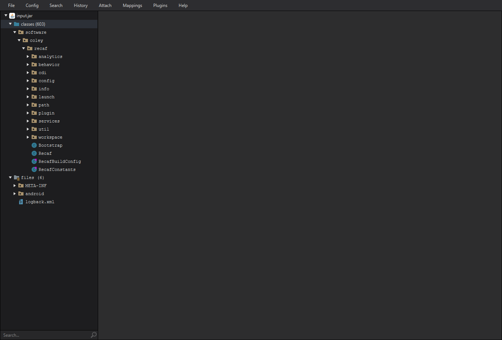

In 4.X this blank space is replaced with a _"summary report"_. It scans the workspace you just opened and gives you some information about it.
Right now there's not too much included in this report (Entry points, warnings about certain kinds of obfuscation & the option to patch it out)
but the content shown can be configured. There is an API for adding your own content to the report, which means plugins can add
any kind of content here. If you do a lot of repetitive analysis tasks that can be automated putting that here could be useful.

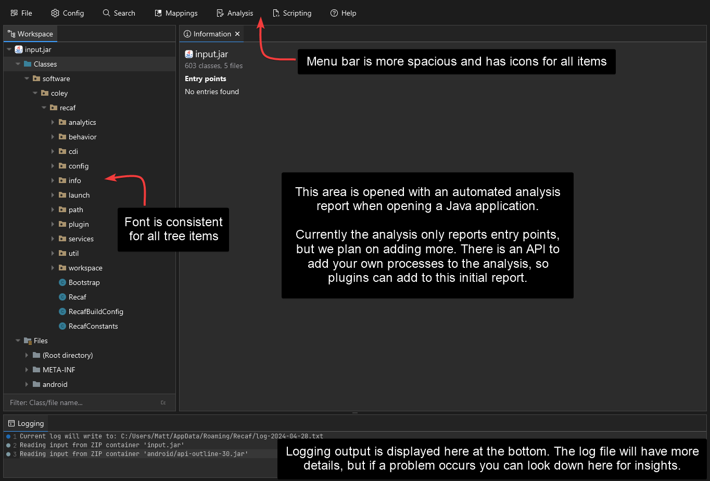

## Class display

The default screen you see when opening a class in Recaf. You right-click on the class name, fields, and methods to interact with it.
This is prone to breaking with certain kinds of naming obfuscation though, as interaction is handled through code AST parsing.
When this occurs you need to switch the class mode to 'Table' which shows you some class info and the table of fields and methods of the class.
While table mode is displayed you don't see the decompiled code, which is a bit unfortunate.

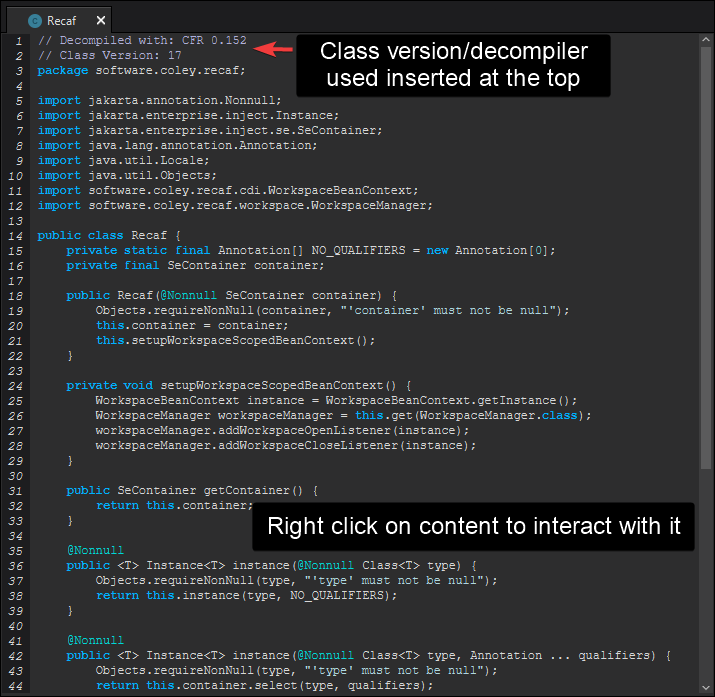

In 4.X there's a number of new buttons and tabs in this display. The problem of name obfuscation and having to switch to table mode
has been addressed by putting the contents of the same tables into the 'Fields & Methods' tab in the top right.

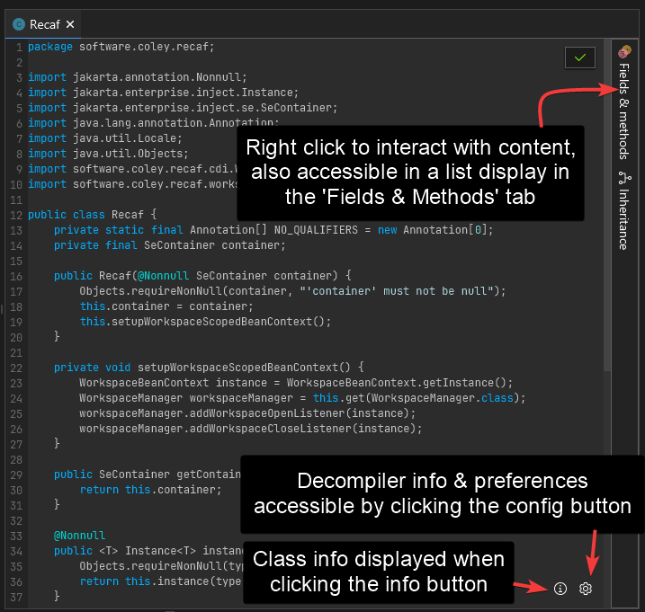

Here's that 'Fields & Methods' tab open when you click on it. It'll close again if you click on it again.

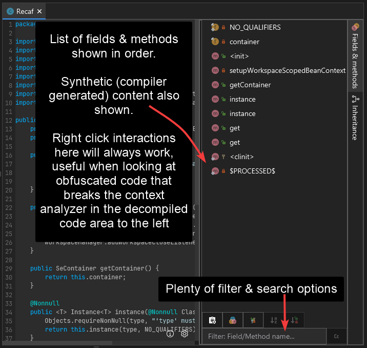

Class information is shown when clicking the 'i' button. Decompiler & Compiler information and options are shown when clicking the gear button.
The same config is accessible in the main config window but is shown & interacted with here for convenience.

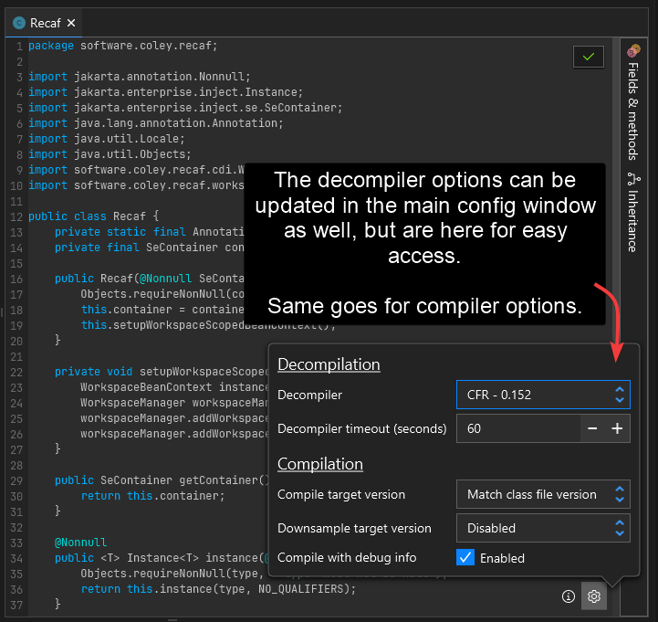

## File display

The file view does not have much changed. Some colors have been swapped out though.

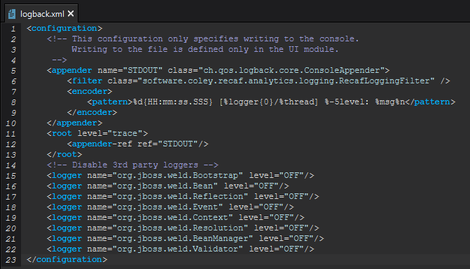

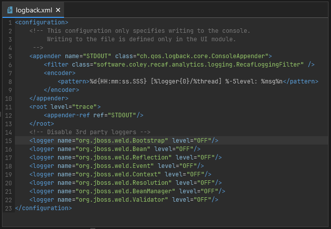

2.X had a very basic hex editor backed by a standard table view. 4.X creates a virtualized table view. The new hex editor is keyboard navigable and acts more like a standard hex editor you'd normally use.

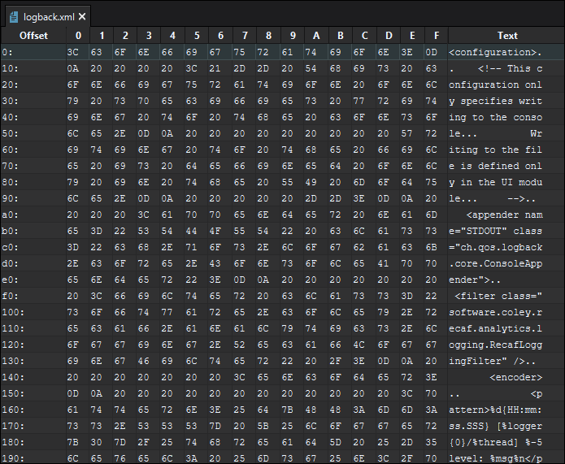

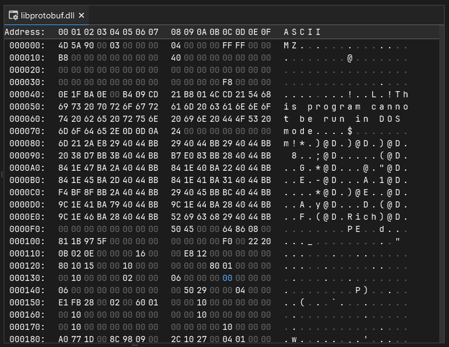

## Searching

Recaf 2.X supports searching for a number of different items.

- Strings
- Numbers
- References
  - Class
  - Member
- Declarations
- Instruction patterns

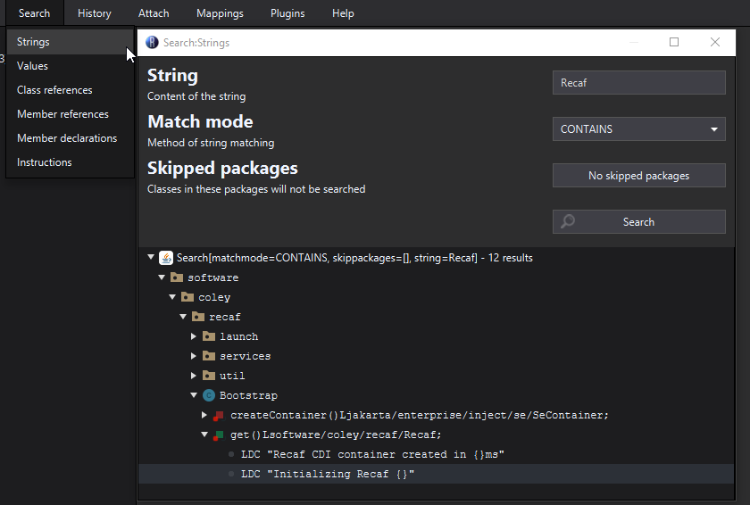

Recaf 4.X has support for all of these in the backend, we're still working on making the UI to reflect these capabilities.
As for the layout differences, the input and match modes are placed next to one another. 
The explicit search button is not necessary as results are shown live as you modify the inputs. 
Changing inputs in succession will cancel old searches and begin displaying results of the up-to-date search inputs.

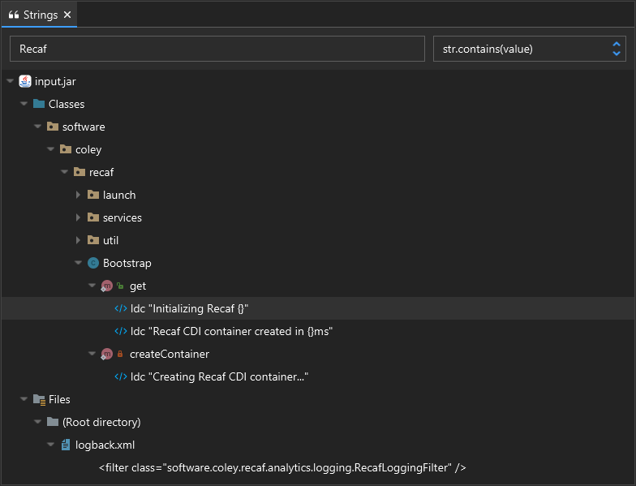

### Agent attaching

Recaf 2.X supported attaching to currently running JVM processes and modifying their bytecode via instrumentation.
The list of available JVM processes looked like this:

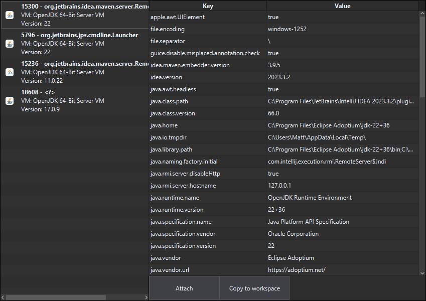

However, there is a major flaw in Recaf 2.X's agent attaching behavior. It injects the whole Recaf application into the remote process.
Recaf is not a small application, and some of the dependencies it uses are used by other applications. Conflicts can easily occur with this approach.

This has been addressed in 4.X. Recaf now only injects a small TCP server into the remote process and communicates changes over a local socket.
The small server has zero dependencies, meaning no potential for conflict.

In addition to a vastly improved backend, the 4.X attach screen shows you much more information about remote processes.

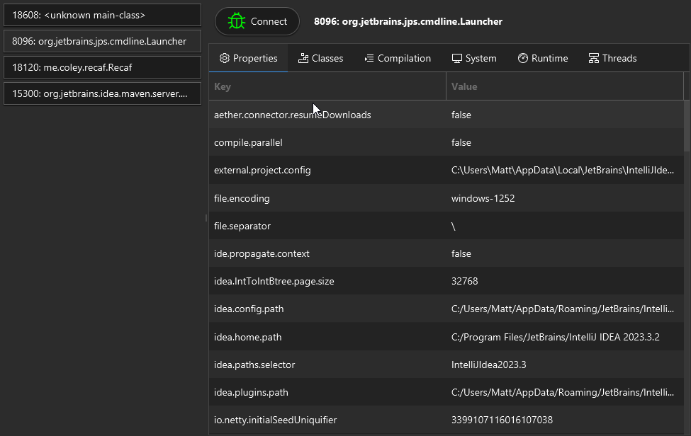

## Config

In Recaf 2.X all config values are stored in one of 5 groups. This works well enough if there is not much you want to have configurable but we wanted to be able to control much more in Recaf 4.X.

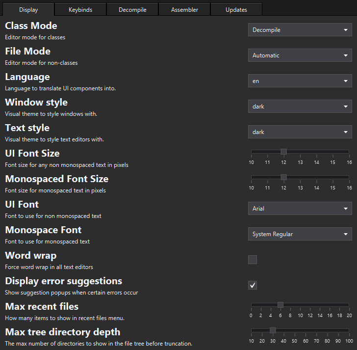

Recaf 4.X now has a config section associated with each feature. 

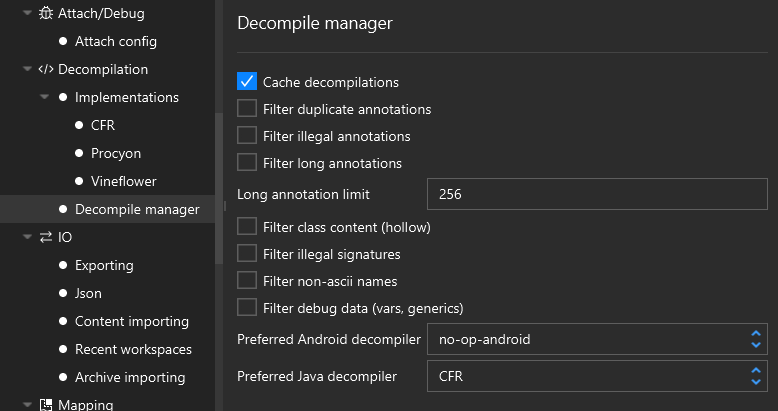