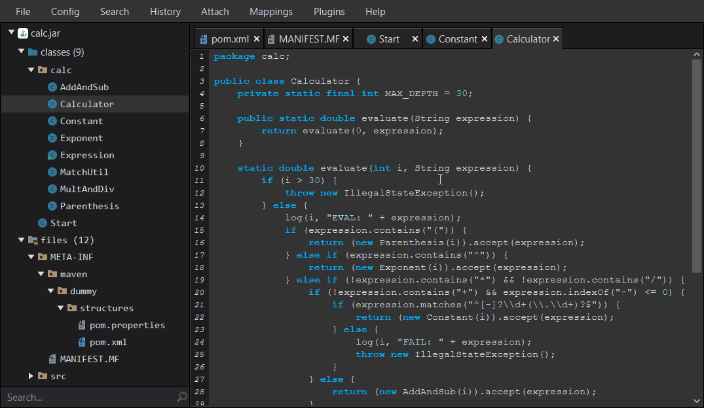

# Recaf    

An easy to use modern Java bytecode editor that abstracts away the complexities of Java programs.
Recaf abstracts away:

* Constant pool
* Stack frames
* Wide instructions
* And more!

Don't know bytecode? That's ok because Recaf supports [recompiling decompiled code](https://col-e.github.io/Recaf-documentation/use-edit-via-decompile.html) and inserting [single line Java statements into the bytecode](https://col-e.github.io/Recaf-documentation/use-assembler.html).

For more information: _[Read the documentation](https://col-e.github.io/Recaf-documentation/)_

## Important notice for newer versions: 3X and 4X

This video explains what's going on in the the Recaf developer space. What's going on with 3x and 4x, and plans for the future.

## Download

See the [releases](https://github.com/Col-E/Recaf/releases) page for the latest build.

## Preface

If you're just getting started with reverse-engineering in Java, read [primer guide](PRIMER.md). Then check the documentation pages.

## Contributing 

**Are you a developer?**

Check out the [open issues](https://github.com/Col-E/Recaf/issues), [project boards](https://github.com/Col-E/Recaf/projects), and many scattered `TODO` messages throughout the source code. There's plenty to do.

**Not a developer?** 

You can help by reporting bugs, making suggestions, providing translations, and sharing this project.

> More information can be found in the [contribution guide](CONTRIBUTING.md).

## Setting up the project

Clone the repository via `git clone https://github.com/Col-E/Recaf.git`

Open the project in an IDE or generate the build with maven.

**IDE**:
  1. Import the project from the `pom.xml`
      * [IntelliJ](https://www.jetbrains.com/help/idea/maven-support.html#maven_import_project_start)
      * [Eclipse](https://stackoverflow.com/a/36242422) - _(Warning: Eclipse's custom compiler cannot compile Recaf because of incorrect generics parsing)_
  2. Create a run configuration with the main class `me.coley.recaf.Recaf`
  
**Without IDE**:
  1. Execute `build`
      * Follow the prompt in the script to build the project.
  2. Run the generated build: `java -jar target/recaf-{version}-jar-with-dependencies.jar`

For additional information, join the [Discord server _(https://discord.gg/Bya5HaA)_](https://discord.gg/Bya5HaA)
