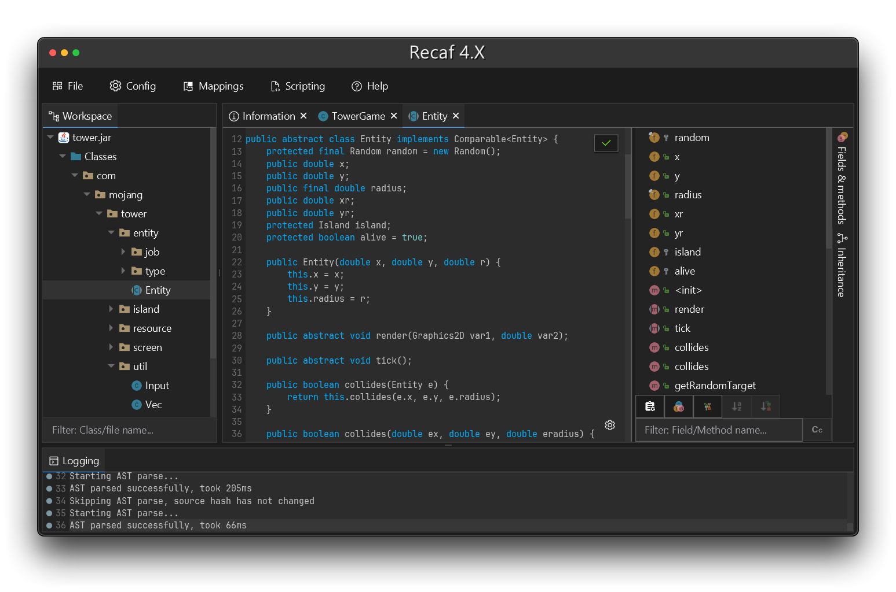

# Recaf     

An easy to use modern Java bytecode editor that abstracts away the complexities of Java programs.

## Download

- [Launcher](https://github.com/Col-E/Recaf-Launcher)
  - Usage & instructions found on the launcher repo
- [Snapshot releases](https://github.com/Col-E/Recaf-Launcher/blob/master/MANUAL.md)
  - See [CI actions](https://github.com/Col-E/Recaf/actions/workflows/build.yml) for release artifacts
- [Independent releases](https://github.com/Col-E/Recaf/releases) _(None for 4X currently)_

## Features

- Edit Java bytecode with ease from a high or low level _(minus the annoying parts)_
    - Editor features within Recaf abstract away complex details of compiled Java applications like:
        - The constant pool
        - Stack frame calculation
        - Using wide instructions when needed
        - And more!
- Easy to use navigable interface with context-sensitive actions
- Support for standard Java _and_ Android applications
- Multiple decompilers to switch between, with all of their parameters made fully configurable
- Built in compiler to allow recompiling decompiled classes, even if some referenced classes are missing *(When supported, support may vary depending on code complexity and obfuscation)*
- A bytecode assembler with a simple syntax, and supporting tooling
    - See the state of local variables and stack values at any point in methods
    - Access variables by names instead of indices for clearer disassembled code
    - Convert snippets of Java source code to bytecode sequences automatically
- Searching for a variety of different content: Strings/numeric constants, classes and member references, instruction patterns
- Tools for deobfuscating obfuscated code
    - Specially crafted class files with the intent of crashing reverse engineering tools are automatically patched when opened in Recaf
    - Specially crafted jar/zip files are read as the JVM does, bypassing sneaky tricks that can trick reverse engineering tools into showing the wrong data
    - Support for automatically renaming obfuscated classes and their members
    - Support for manually renaming classes and their members *_(And exporting these mappings to a variety of mapping formats for use in other tools)_*
- Attach to running Java process with instrumentation capabilities
- And much more

A complete list of features can be found in the [user documentation](https://recaf.coley.software/user/index.html).

## Scripting & Plugins

Recaf exposes almost all of its functionality through modular API's. Automating behaviors can be done easily with scripts, or with plugins for more complex situations. Additional features can also be added via plugins, which can register hooks in API's that offer them.

To create your own script or plugin, see the [developer documentation](https://recaf.coley.software/dev/index.html), specifically the _"plugins & scripts"_ section.

## Command Line

Recaf can run as a command line application, which can be especially useful when paired with scripts provided at startup. You can see all the current launch arguments by passing `--help` as an application argument.

## Development Setup

Clone the repository via `git clone https://github.com/Col-E/Recaf.git`

Open the project in an IDE or generate the build with gradle.

**IDE**:
1. Import the project from the `build.gradle` file
2. Create a run configuration with the main class `software.coley.recaf.Main`

**Without IDE**:
1. Run `gradlew build`
    - Output will be located at: `recaf-ui/build/libs/recaf-ui-{VERSION}-all.jar`
