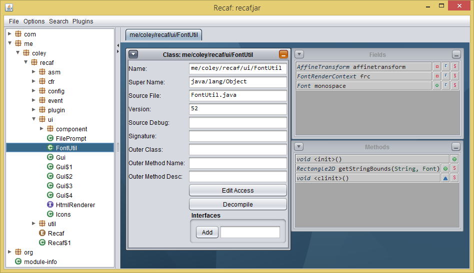

# Recaf    

An easy to use modern Java bytecode editor that abstracts away the complexities of Java programs. 
Recaf will automatically handle generation of stack frames and constant pool entries for you.

## Preface

If you're just getting started with reverse-engineering in Java, read [PRIMER.md](PRIMER.md).

Documentation for `2.0.0` is on hold until `redesign` is merged into `master`.
In the meantime check out [some usage posts on the blog](https://coley.software/category/recaf/).

## Getting Started

Clone the repository via `git clone -b redesign https://github.com/Col-E/Recaf.git`

Open the project in an IDE or generate the build with maven.

**IDE**:
  1. Import the project from the `pom.xml`
      * [IntelliJ](https://www.jetbrains.com/help/idea/maven-support.html#maven_import_project_start)
      * [Eclipse](https://stackoverflow.com/a/36242422)
  2. Create a run configuration with the main class `me.coley.recaf.Recaf`
  
**Without IDE**:
  1. Execute `build`
      * Will run `build` or `build.cmd` based on your OS. 
      * Follow the prompt in the script to build the project.
  2. Run the generated build: `java -jar target/recaf-{version}-jar-with-dependencies.jar`

For additional information, join the [Discord server _(https://discord.gg/Bya5HaA)_](https://discord.gg/Bya5HaA) and check the [blog post on getting started](https://coley.software/recaf-getting-started-primer/).

## Contributing 

Even if you're not a developer you can still contribute to Recaf. 
Check out the [contribution guide here](CONTRIBUTING.md) for more information.