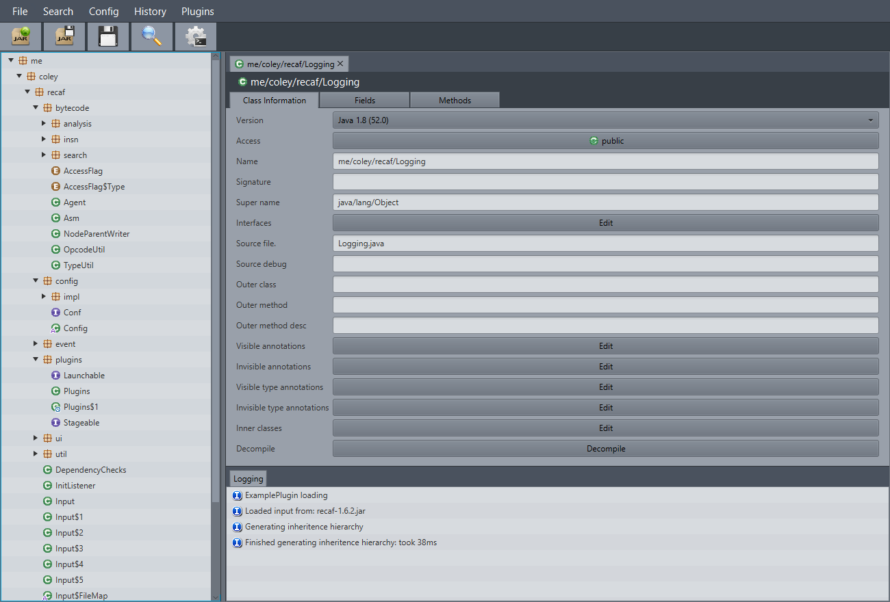

# Recaf 
An easy to use modern Java bytecode editor based on Objectweb's ASM. No more hassling with the constant pool or stack-frames required. Check out [the docs](https://col-e.github.io/Recaf/index.html) for more information.

**Important site links**:

* _[Usage & Documentation](https://col-e.github.io/Recaf/documentation.html)_
* _[Features](https://col-e.github.io/Recaf/features.html)_

### Download

See the [releases](https://github.com/Col-E/Recaf/releases) page for the latest build. Or you could compile with maven via `mvn package`

### Libraries used:

* [ASM](http://asm.ow2.org/) - _Class editing abilities_
* [CFR](http://www.benf.org/other/cfr/) - _Decompilation_
* [minimal-json](https://github.com/ralfstx/minimal-json) - _Json reading/writing for config storage_
* [JIMFS](https://github.com/google/jimfs) - _Virtual file system_
* [ControlsFX](http://fxexperience.com/controlsfx/) - _Custom controls (Used in pretty much everything)_
* [RichTextFX](https://github.com/FXMisc/RichTextFX) - _Decompiler code highlighting_
* [picocli](http://picocli.info/) - _Command line argument parsing_
* [Simple-Memory-Compiler](https://github.com/Col-E/Simple-Memory-Compiler) - _Recompilation of decompiled code_

### Screenshots

For more screenshots check the [screenshots directory](docs/screenshots).