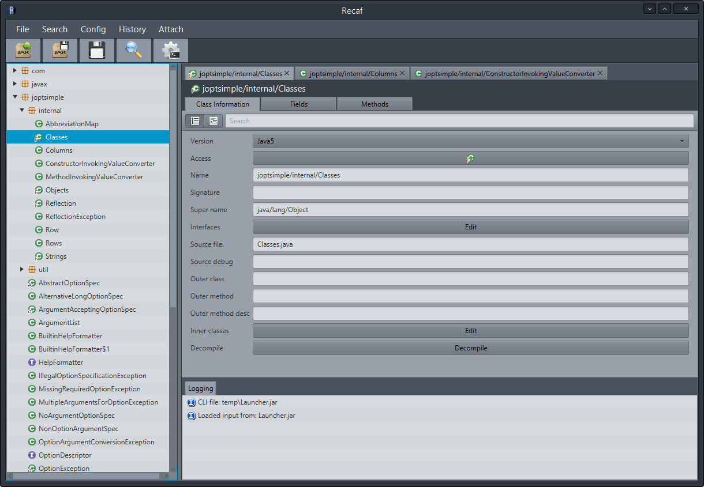

# Recaf 

**Notice**: `2.0.0` is in the works on a separate branch, [check it out](https://github.com/Col-E/Recaf/tree/redesign) to see the current progress. Additionally if you have any feedback or suggestions for `2.0.0` please drop a comment on the [discussion thread](https://github.com/Col-E/Recaf/issues/158) or [join the discord](https://discord.gg/Bya5HaA).

An easy to use modern Java bytecode editor based on Objectweb's ASM. No more hassling with the constant pool or stack-frames required. Check out [the docs](https://col-e.github.io/Recaf/index.html) for more information.

* _[Usage & Documentation](https://col-e.github.io/Recaf/documentation.html)_
* _[Feature chart](https://col-e.github.io/Recaf/features.html)_

### Download

See the [releases](https://github.com/Col-E/Recaf/releases) page for the latest build. Or you could compile with maven via `mvn package`

### Screenshots

For more screenshots check the [screenshots directory](docs/screenshots). They appear throughout the documentation as well.

### Libraries used:

* [ASM](http://asm.ow2.org/) - _Class editing abilities_
* [CFR](http://www.benf.org/other/cfr/) - _Decompilation_
* [Simple-Memory-Compiler](https://github.com/Col-E/Simple-Memory-Compiler) - _Recompilation of decompiled code_
* [ControlsFX](http://fxexperience.com/controlsfx/) - _Custom controls (Used in pretty much everything)_
* [RichTextFX](https://github.com/FXMisc/RichTextFX) - _Decompiler code highlighting_
* [JRegex](http://jregex.sourceforge.net/) - _Pattern matching for decompiler code highlighting_
* [minimal-json](https://github.com/ralfstx/minimal-json) - _Json reading/writing for config storage_
* [Commonmark](https://github.com/atlassian/commonmark-java) - _Markdown parsing_
* [Guava](https://github.com/google/guava) - _Misc utilities_
* [picocli](http://picocli.info/) - _Command line argument parsing_
* [PlugFace](https://github.com/matteojoliveau/plugface) - _Plugin jar loading_
