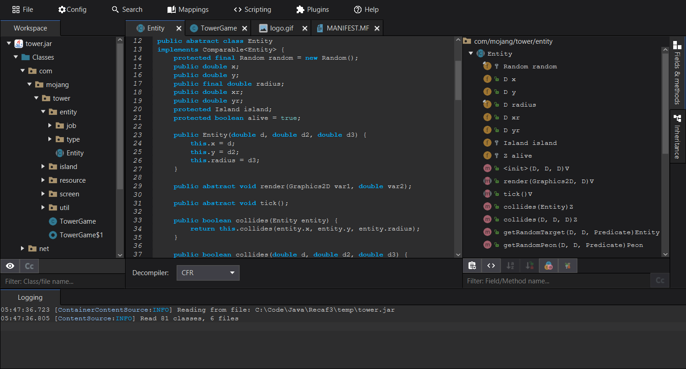

# Recaf 3.X - Dev branch  

This is the 3rd redesign branch. It is currently a work-in-progress. We would very much appreciate it if you tried it out and gave us feedback.

Pre-releases and progress is tracked here: [Recaf 3X: Issues & pre-releases](https://github.com/Col-E/recaf-3x-issues/)

## Usage

To build, run `gradlew clean shadowJar`, which will generate `recaf-ui\build\libs\recaf-$VERSION$-SNAPSHOT-J11-jar-with-dependencies.jar`.

To run from inside an IDE, the main class in the `UI` module is `me.coley.recaf.Main`.